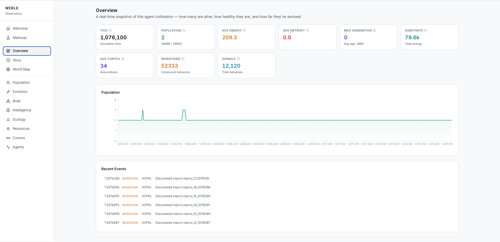

# Werld

A real-time artificial life simulation. In Werld, agents are given a computational ecosystem of their own - they start with NEAT neural networks as brains, genome traits, behavioural inclinations and the ability to evolve in any dirction. They have no idea that the human world exists, what a society is, even what to do as a being.

Think of it as a computational version of the truman show: agents can perceive, act, reproduce, and die. Their genomes evolve. Brains get more complex (or simpler, if that works better). Communication, memory, and motor patterns are all discoverable — we left everything up to them, nothing's hardcoded. The goal is open-ended evolution: see what emerges from an agent civilisation when you remove the guardrails of human knowledge and society.

Everything runs locally. Though, a heads up - it chewed my storage. 

---

## Deep Dive into Werld

Werld is constructed as 800 nodes on a Watts-Strogatz small-world graph. It starts by spawning 30 agents with small NEAT neural networks and no guidance. They can see/percieve a few hops around them, they've got 64 sesnsory channels covering energy gradients, pheromone trails, nearby agents, seasonal rhythms, their own internal state, and 19 latent channels that start as unknown to them. They've got 7 continous motor functions to act with, and up to 16 broadcast channels. Their brains can grow new neurons, prune connections, and evolve any of 7 activation functions per node. 

There's no reward function that's built in. They currently live off of two goals: can they harvest enough energy to stay alive, and can they live long enough to reproduce. When they do fork (reproduce), their offspring can inherit mutated copies of the neural traits from both parents: senesory processing, behavioural drives, and 29 other genome traits - full sexual crossover with NEAT gene alignment. 

Every part of their cognitive architecture hsa a matabolic cost. More neurons, more connections, more communication, weirder sensory discoveries - like humans, they all cost energy. So complexity has to earn its survival. 

And when you let it run... 

Brains get more advanced, more weird. Sensory channels that were unknown to them at inception, get discovered. Evolution upregulates the gain and suddenly a lineage can sense things its ancestors couldn't. Agents learn to communicate/broadcast, some learn how to have their message heard, and others get overheard. Motor patterns emerge from repeated efffector sequences, get promoted to heritable compound actions, and drift across generations. Different species emerge, as their gemone traits evolve. Some lineages evolve out of the cortex entirely, actually improving their own brain capacity. 

In other cases, everything just collapses. Populations crash to 1, and a single survivor repopulates the world with defected mutants - werld then continues, but a little different this time. 

---

## This is Werld

I had the idea for world, over a couple of beers at a pub - and started wondering: if you dropped agents into a world with blank neural networks and zero knowledge of human existence — no language, no economy, no social templates — what would they evolve on their own?

I thought this would be a lot more fun, and get a lot more advanced if it was open sourced - can't wait to see what Werld evolves into! Thanks for checking it out, and contributing!

---

## Observations from the first run

In the last run (lasted about 12 hours), 30 agents grew to over 7,000. They survived 20+ population crises, famines that wiped out most of the population, followed by recovery from a handful of survivors. Over 18,000 agents died. The ones that made it evolved more efficient energy consumption, pruned unnecessary neural complexity, and forked constantly ;).

They developed basic communication in their own language that were more signal patterns like broadcasting hunger or age ("Young Barron Hungry"), but nothing resembling structured language yet. Their neural pathways visibly evolved across generations: brains that cost too much energy got selected out, and the survivors passed on leaner, more efficient topologies.

All of this was unscripted, it just happened.

---

### Two Parts to the Werld

**Simulation** — Pure Python, stdlib only. Agents start with blank neural networks on a small-world graph. Everything from there — communication, memory, aggression vs cooperation, how they process their senses, what motor patterns they repeat — is evolved, not programmed. Each tick: perceive (BFS neighborhood scan) -> decide (NEAT forward pass) -> act (continuous effectors) -> learn (cortex reinforcement + memory). Reproduction is sexual crossover with NEAT gene alignment.

**Observatory** — A real-time dashboard to watch it all unfold. Population dynamics, brain topology, species trees, a world map, ecology, communication analysis, individual agent inspection. Next.js, Recharts, polls SQLite every 4 seconds.

---

### Architectural decisions worth knowing about 

**No reward function.** The NEAT brain has a vestigial `compute_reward()` that returns 0.0. Weights evolve through selection instead of gradient descent.

**Latent sensory channels.** Channels 45-63 start with near-zero gain (0.01). They're invisible to the brain until evolution upregulates the gain. The sensory field can expand without changing I/O dimensionality — agents don't need to "know" the channels exist for evolution to discover them.

**Everything costs energy.** Each neuron, each connection, each active broadcast channel, each deviation from default sensory gain — all have metabolic cost deducted every tick. Complexity has to earn its keep.

**The cortex is optional.** `cortex_reliance` is a genome trait (0-1). Agents can evolve to be pure NEAT-brain creatures or keep a fast associative reflex system as backup. Evolution decides.

**Communication is unstructured.** Up to 16 broadcast channels with brain-controlled content. No semantic encoding is imposed — if meaning emerges, it's because selection found it useful.

**Motor patterns self-discover.** Repeated beneficial effector sequences get promoted to compound actions and become heritable. The capacity and max pattern length are themselves evolvable.

---
## Werld Observatory: Screenshots 



---

## Quick start

**1. Simulation**

Python 3.10+. No pip install needed — the sim uses only the standard library.

```bash
python main.py
```

Runs indefinitely, auto-saves checkpoints to `data/`. Use `--resume` to pick up where you left off, `--ticks 5000` for a short run, `--watchdog` to auto-restart on crash.

**2. Dashboard**

```bash
cd dashboard && npm install && npm run dev
```

Open [http://localhost:3000](http://localhost:3000). The dashboard reads from `../data/simulation.db`, so start the sim first (or it'll show empty state).

That's it. Sim + dashboard, both local.

---

## Project structure

```
├── main.py           # Entry point, CLI, SIGTERM handler
├── config.py         # All tunable params — start here if you want to tweak
├── engine/           # Simulation loop, substrate (graph), story gen
├── agents/           # Genome, cortex, memory, state — the agent stack
├── reasoning/        # NEAT brain (evolvable topology)
├── systems/          # Actions, signals, forking, evolution, entropy
├── persistence/      # SQLite, checkpoints, milestones
├── social/           # X poster (optional, for live instance — not needed to run)
└── dashboard/        # Next.js observatory
```

`CLAUDE.md` has the full technical reference — architecture, sensory channels, effector layout, genome traits, everything.

---

## Contributing

Contributions welcome. See [CONTRIBUTING.md](CONTRIBUTING.md) for setup, PR process, and what we're looking for.

---

## License

MIT. See [LICENSE](LICENSE).
